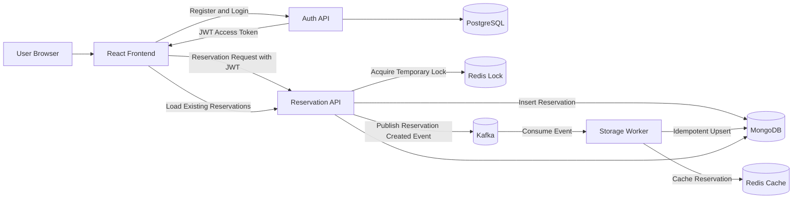
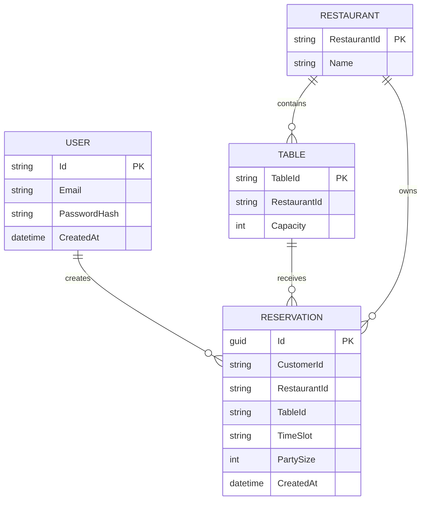
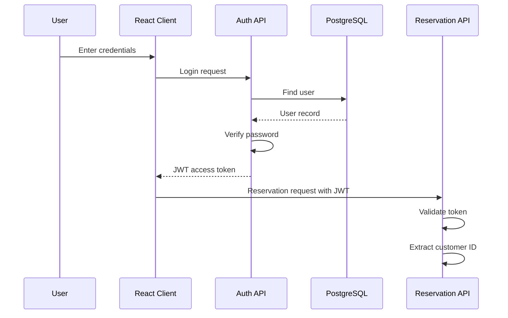
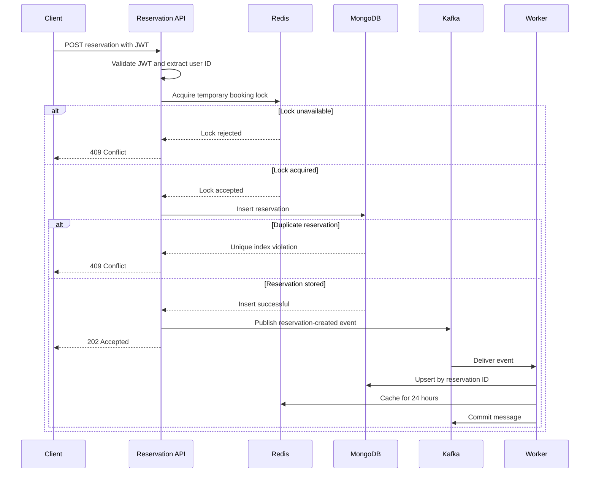
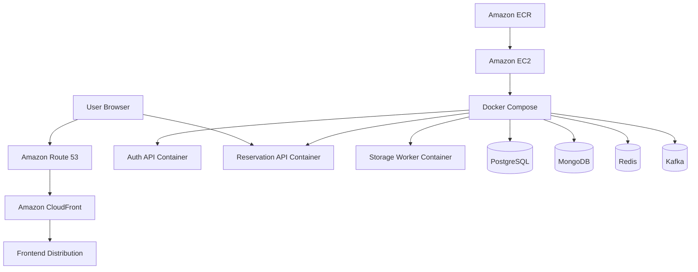

# MicroBooker

MicroBooker is a distributed restaurant table reservation system built to demonstrate practical backend engineering concepts such as concurrency control, authentication, event-driven communication, background processing, caching, containerization, and cloud deployment.

The application allows authenticated users to select a restaurant table and time slot, create a reservation, and view unavailable booking combinations.

## Live Application

- Frontend: `https://microbooker.babakraeisi.com`
- Reservation API: `https://api.microbooker.babakraeisi.com`

Authentication is provided by a separate microservice:

- Repository: `AuthMicroservice`
- Database: PostgreSQL
- Authentication: JWT access tokens

---

## Main Features

- User registration and login through a separate authentication service
- JWT-protected reservation creation
- Restaurant table and time-slot selection
- Redis-based distributed locking
- MongoDB duplicate-booking protection
- Kafka event publishing and consumption
- Background worker processing
- Redis reservation caching
- React-based reservation interface
- Docker-based local and production environments
- AWS EC2 and Amazon ECR deployment
- Health and liveness endpoints

---

## Technology Stack

### Frontend

- React
- Vite
- JavaScript
- Context API

### Reservation Backend

- ASP.NET Core
- C#
- JWT Bearer authentication
- Layered architecture
- MongoDB
- Redis
- Apache Kafka

### Authentication Service

- ASP.NET Core
- C#
- PostgreSQL
- Dapper
- BCrypt
- FluentValidation
- JWT

### Infrastructure and Deployment

- Docker
- Docker Compose
- Amazon EC2
- Amazon Elastic Container Registry
- GitHub Actions
- CloudFront
- Route 53
- HTTPS

---

## System Architecture



---

## Current Reservation Flow

The current reservation workflow is:

1. The user registers or logs in through the Auth API.
2. The Auth API validates the credentials and returns a JWT.
3. The frontend includes the JWT when sending a reservation request.
4. The Reservation API validates the JWT.
5. The API extracts the customer ID from the JWT instead of trusting a customer ID sent by the frontend.
6. The API attempts to acquire a temporary Redis lock for the selected table and time.
7. If the lock cannot be acquired, the API returns `409 Conflict`.
8. If the lock succeeds, the API attempts to insert the reservation into MongoDB.
9. MongoDB uses a unique compound index to prevent duplicate reservations for the same restaurant, table, and time.
10. If the reservation already exists, the API returns `409 Conflict`.
11. After the reservation is saved, the API publishes a reservation-created event to Kafka.
12. The Storage Worker consumes the Kafka event.
13. The worker performs an idempotent MongoDB upsert.
14. The worker stores a cached copy of the reservation in Redis for 24 hours.
15. The worker commits the Kafka message after successful processing.
16. The API returns `202 Accepted` to the client.

---

## Why Redis Is Used

Redis has two responsibilities in the current system.

### Distributed Locking

Redis provides a temporary lock while a reservation request is being processed.

This reduces the chance of two application instances processing the same table and time simultaneously.

A normal in-memory application lock would only protect one running API instance. Redis provides shared coordination when multiple API instances are running.

The lock is temporary and currently expires after 30 seconds.

### Reservation Cache

The Storage Worker also saves a cached copy of each processed reservation in Redis.

The cached reservation expires after 24 hours.

This demonstrates how frequently accessed data can be made available without repeatedly querying the primary database.

### Important Consistency Rule

Redis is not the final protection against duplicate bookings.

MongoDB remains the authoritative source of truth through its unique compound index.

Redis provides fast early protection, while MongoDB provides the final database-level guarantee.

---

## Why Kafka Is Used

Kafka is used to publish events after reservations are successfully created.

The Reservation API acts as the producer.

The Storage Worker acts as the consumer.

The API publishes a reservation-created event without directly coordinating every downstream operation.

This allows additional consumers to be added later for responsibilities such as:

- Email confirmations
- Restaurant notifications
- Analytics
- Audit logging
- Payment processing
- Reporting

Kafka demonstrates asynchronous and event-driven communication between application components.

For a smaller application, alternatives could include:

- RabbitMQ
- Amazon SQS
- Azure Service Bus
- Hangfire
- Direct background jobs
- Direct service-to-service communication

Kafka was selected for this project to demonstrate producer-consumer communication and event-driven system design.

---

## Producer and Consumer Model

### Producer

The Reservation API is the Kafka producer.

After MongoDB successfully stores a reservation, the API publishes a message describing the created reservation.

### Kafka

Kafka stores the event in the `reservations` topic.

It acts as the communication layer between the API and background consumers.

### Consumer

The Storage Worker subscribes to the `reservations` topic.

When a new event is available, the worker:

1. Reads the event
2. Converts the message into a reservation object
3. Upserts the reservation in MongoDB
4. Stores the reservation in Redis
5. Commits the Kafka message

The worker uses the consumer group:

```text
storage-worker-group
```

Manual message commits are used so the Kafka offset is committed only after processing completes.

---

## Data Consistency Strategy

MicroBooker uses multiple layers of protection.

### Frontend Availability Check

The frontend loads existing reservations and disables known unavailable table and time combinations.

This improves the user experience but is not considered a security or consistency guarantee.

A user could bypass the frontend and call the API directly.

### Redis Lock

The Redis lock reduces concurrent processing of the same booking request.

It is useful when multiple API instances share the same Redis server.

### MongoDB Unique Index

MongoDB provides the final duplicate-booking protection.

The unique compound index contains:

- `RestaurantId`
- `TableId`
- `TimeSlot`

This ensures that the same table cannot be reserved twice for the same restaurant and time.

---

## Entity Relationship Diagram

The authentication and reservation services use separate databases.

There is no database-level foreign key between PostgreSQL and MongoDB.

The reservation’s `CustomerId` is populated from the authenticated JWT and logically refers to a user managed by the Auth service.



### Current Model Note

At present, `Restaurant` and `Table` are represented primarily through identifiers used by the frontend and reservation records.

They are included in the diagram to show the intended business relationship.

The main persisted reservation document contains:

- `Id`
- `CustomerId`
- `RestaurantId`
- `TableId`
- `TimeSlot`
- `PartySize`
- `CreatedAt`

---

## Repository Structure

```text
MicroBooker/
│
├── MicroBooker.Client/
│   └── React frontend
│
├── Reservation.Api/
│   ├── API controllers
│   ├── JWT authentication
│   ├── dependency injection
│   ├── MongoDB index creation
│   └── health endpoints
│
├── MicroBooker.Application/
│   ├── reservation use cases
│   ├── reservation request DTO
│   └── booking orchestration
│
├── MicroBooker.Domain/
│   ├── Reservation entity
│   ├── ILockService
│   ├── IEventPublisher
│   └── IReservationRepository
│
├── MicroBooker.Infrastructure/
│   ├── RedisLockService
│   ├── KafkaEventPublisher
│   └── MongoReservationRepository
│
├── MicroBooker.StorageWorker/
│   ├── Kafka consumer
│   ├── MongoDB upsert
│   └── Redis caching
│
├── docker-compose.yml
└── README.md
```

---

## Component Responsibilities

### MicroBooker.Client

The React frontend is responsible for:

- User interaction
- Registration and login requests
- JWT storage and usage
- Restaurant table selection
- Date and time selection
- Party-size selection
- Loading existing reservations
- Disabling known unavailable slots
- Sending authenticated reservation requests

### Reservation.Api

The Reservation API is responsible for:

- Accepting HTTP requests
- Validating JWTs
- Extracting the authenticated customer identity
- Returning existing reservations
- Calling the application service
- Returning HTTP responses
- Configuring MongoDB, Redis, Kafka, authentication, and CORS
- Creating the unique MongoDB reservation index
- Providing health endpoints

### MicroBooker.Application

The application layer coordinates the booking use case.

The Reservation Service:

1. Acquires the Redis lock
2. Creates the reservation object
3. Attempts to insert the reservation into MongoDB
4. Publishes the Kafka event
5. Returns the reservation result

### MicroBooker.Domain

The domain layer contains the core business model and service contracts.

It does not depend on Redis, Kafka, MongoDB, or ASP.NET Core implementations.

### MicroBooker.Infrastructure

The infrastructure layer contains external system implementations.

It provides:

- Redis distributed locking
- Kafka event publishing
- MongoDB reservation persistence

### MicroBooker.StorageWorker

The Storage Worker runs independently from the HTTP API.

It:

- Subscribes to the Kafka `reservations` topic
- Processes reservation-created events
- Upserts reservations in MongoDB
- Caches reservations in Redis
- Commits Kafka offsets manually

---

## API Endpoints

### Health Check

```http
GET /health
```

Example response:

```text
Healthy
```

### Liveness Check

```http
GET /live
```

Example response:

```text
ok
```

### Get Reservations

```http
GET /api/reservations
```

This endpoint currently allows anonymous access.

Example response:

```json
[
  {
    "id": "cbe93a60-ae99-4b7e-9d48-d168ba4004c9",
    "customerId": "user-id-from-auth-service",
    "restaurantId": "demo-restaurant-1",
    "tableId": "table_number_2",
    "timeSlot": "2026-07-30T20:00:00",
    "partySize": 2,
    "createdAt": "2026-07-30T18:34:42.060Z"
  }
]
```

### Create Reservation

```http
POST /api/reservations
Authorization: Bearer <access-token>
Content-Type: application/json
```

Example request:

```json
{
  "restaurantId": "demo-restaurant-1",
  "tableId": "table_number_2",
  "timeSlot": "2026-07-30T20:00:00",
  "partySize": 2
}
```

The API does not trust a client-provided customer ID.

The customer ID is taken from the authenticated JWT.

### Responses

#### Successful Reservation

```http
202 Accepted
```

#### Slot Locked or Already Reserved

```http
409 Conflict
```

Example:

```json
{
  "message": "Slot is locked or already booked."
}
```

#### Missing or Invalid Authentication

```http
401 Unauthorized
```

---

## MongoDB Reservation Document

Example reservation document:

```json
{
  "id": "cbe93a60-ae99-4b7e-9d48-d168ba4004c9",
  "customerId": "authenticated-user-id",
  "restaurantId": "demo-restaurant-1",
  "tableId": "table_number_2",
  "timeSlot": "2026-07-30T20:00:00",
  "partySize": 2,
  "createdAt": "2026-07-30T18:34:42.060Z"
}
```

Database:

```text
BookerDb
```

Collection:

```text
reservations
```

Unique index:

```text
RestaurantId + TableId + TimeSlot
```

---

## Authentication Flow



The Reservation API validates:

- JWT issuer
- JWT audience
- JWT signature
- JWT expiration

The customer identity is extracted from the token claims.

---

## Reservation Sequence



---

## Local Development

### Prerequisites

Install:

- .NET SDK
- Node.js
- Docker Desktop
- Git

### Clone the Repository

```bash
git clone https://github.com/BabakRaeisi/MicroBooker.git
cd MicroBooker
```

### Start Infrastructure

```bash
docker compose up -d
```

The Docker environment should provide services such as:

- Redis
- MongoDB
- Kafka
- Zookeeper, when required by the configured Kafka image

### Start the Reservation API

```bash
cd Reservation.Api
dotnet run
```

The default configured address is:

```text
http://localhost:5147
```

### Start the Storage Worker

Open another terminal:

```bash
cd MicroBooker.StorageWorker
dotnet run
```

### Start the React Client

Open another terminal:

```bash
cd MicroBooker.Client
npm install
npm run dev
```

---

## Configuration

Configuration values may be supplied through `appsettings.json`, environment-specific settings, Docker Compose, or environment variables.

### Reservation API

Required configuration includes:

```text
ConnectionStrings:Mongo
ConnectionStrings:Redis
Kafka:BootstrapServers
Jwt:Issuer
Jwt:Audience
Jwt:Key
```

### Storage Worker

Required configuration includes:

```text
ConnectionStrings:Mongo
ConnectionStrings:Redis
Kafka:BootstrapServers
```

### Frontend

The frontend requires API addresses for:

```text
VITE_API_BASE_URL
VITE_AUTH_BASE_URL
```

Do not commit production secrets or signing keys to the repository.

Use environment variables or a secrets-management service for sensitive values.

---

## CORS Configuration

The Reservation API currently permits the following frontend origins:

```text
http://localhost:5173
http://localhost:4200
https://microbooker.babakraeisi.com
```

The production frontend origin must also be allowed by the separate Auth API.

---

## AWS Deployment

The production version is deployed on AWS.

### Deployment Overview



### Deployment Process

1. Code is pushed to GitHub.
2. GitHub Actions builds the Docker image.
3. The image is pushed to Amazon ECR.
4. The EC2 instance authenticates with ECR.
5. Docker Compose pulls the latest image.
6. The affected container is recreated.
7. Health endpoints and API requests are tested.

---

## Verification Checklist

After starting or deploying the system, verify:

- The frontend loads successfully
- Registration works
- Login returns a JWT
- Authenticated reservation creation returns `202 Accepted`
- Rebooking the same restaurant, table, and time returns `409 Conflict`
- Reservations appear in MongoDB
- The worker consumes Kafka messages
- Worker logs show MongoDB upserts
- Worker logs show Redis caching
- `GET /api/reservations` returns stored reservations
- Booked slots are disabled in the frontend
- `/health` returns a successful response
- `/live` returns a successful response

---

## Troubleshooting

### Frontend Cannot Reach the API

Check:

- The API container or process is running
- The frontend API URL is correct
- DNS is configured correctly
- HTTPS is working
- The frontend origin is included in the API CORS policy

### Login Works Through Direct API Calls but Fails in the Browser

This is commonly a CORS problem.

Ensure the Auth API allows:

```text
https://microbooker.babakraeisi.com
```

### Reservation Returns 401

Check:

- The Authorization header is present
- The token begins with `Bearer`
- The token has not expired
- The Auth API and Reservation API use matching issuer, audience, and signing-key settings
- The token contains a supported user ID claim

### Reservation Returns 409

The selected slot is either:

- currently protected by the Redis lock; or
- already stored in MongoDB.

### Reservation Does Not Appear in the Frontend

Check:

- The reservation exists in MongoDB
- `GET /api/reservations` is working
- The frontend reloads reservation availability
- The frontend normalizes the table and time values consistently

### Worker Does Not Receive Messages

Check:

- Kafka is running
- The producer and consumer use the same bootstrap server
- Both use the `reservations` topic
- The worker is running
- Network connectivity between containers is working
- Kafka advertised listeners are configured correctly

### Worker Reprocesses a Message

Kafka may redeliver a message when processing finishes but the offset is not committed.

The worker uses a MongoDB upsert by reservation ID to make repeated processing safer.

This is an idempotent-processing strategy.

---

## Design Decisions

### Why Use a Separate Auth Service?

Authentication is separated from reservation logic so each service has a focused responsibility.

The Auth service manages:

- User accounts
- Password hashing
- Credential validation
- JWT generation

The Reservation API only validates the issued token and uses its customer identity.

### Why Use MongoDB?

Reservation records are simple documents and can be stored without complex joins.

MongoDB also provides:

- Flexible document storage
- Compound indexes
- Unique constraints
- Good support for time-based records
- Straightforward integration with .NET

### Why Use PostgreSQL for Authentication?

User accounts have structured and relational data requirements.

PostgreSQL provides:

- Strong consistency
- Unique email constraints
- Transactions
- Structured querying
- Reliable relational storage

### Why Use Redis?

Redis provides fast shared locking across API instances and short-lived caching.

### Why Use Kafka?

Kafka allows reservation events to be processed independently from the original API request and supports future event consumers.

### Why Keep the Database Unique Index?

Distributed locks can expire or fail.

The database must still enforce the final consistency rule.

The unique MongoDB index is the authoritative double-booking safeguard.

---

## Current Limitations

This project is a portfolio and learning system rather than a complete commercial booking platform.

Current limitations include:

- The Redis lock key does not currently include `RestaurantId`
- The worker repeats a MongoDB write already performed by the API
- Event publishing is not transactional with the MongoDB insert
- A saved reservation can exist even if Kafka publishing fails
- No transactional outbox is implemented
- No dead-letter topic is configured
- No automated retry policy exists for failed events
- Cancellation and modification workflows are limited
- Restaurant and table management are not fully modeled
- Redis cache reads are not yet part of the main reservation query path
- Public reservation retrieval may expose more information than a production API should return
- Secrets should be moved to a managed secrets service
- Production databases and messaging could be moved to managed cloud services

---

## Planned Improvements

- Add `RestaurantId` to the Redis lock key
- Implement the transactional outbox pattern
- Add Kafka retry and dead-letter topics
- Add integration tests for simultaneous reservations
- Add cancellation and reservation modification
- Add admin authorization
- Add restaurant and table management
- Add pagination and filtering
- Return dedicated response DTOs instead of complete persistence models
- Protect reservation queries based on user or admin permissions
- Use Redis cache during read operations
- Add OpenTelemetry tracing
- Add structured centralized logging
- Add metrics for booking conflicts and Kafka processing
- Store secrets in AWS Secrets Manager or Systems Manager Parameter Store
- Add automated deployment smoke tests

---

## Interview Summary

A concise description of the project:

> MicroBooker is a distributed restaurant reservation system built with React and ASP.NET Core. Authentication is handled by a separate PostgreSQL-based Auth service that issues JWTs. When an authenticated user creates a reservation, the Reservation API uses Redis for temporary distributed locking and MongoDB with a unique compound index as the final double-booking safeguard. After storing the reservation, the API publishes an event to Kafka. A background worker consumes the event, performs an idempotent MongoDB upsert, caches the reservation in Redis, and manually commits the Kafka message. The application is containerized with Docker and deployed on AWS using EC2, ECR, Route 53, CloudFront, and GitHub Actions.

---

## License

This project was created as a portfolio and learning project.

Add a license file before allowing external reuse or redistribution.

---

## Author

**Babak Raeisi**

- GitHub: `https://github.com/BabakRaeisi`
